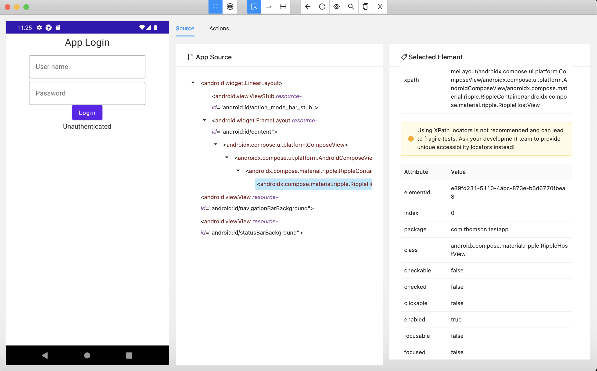
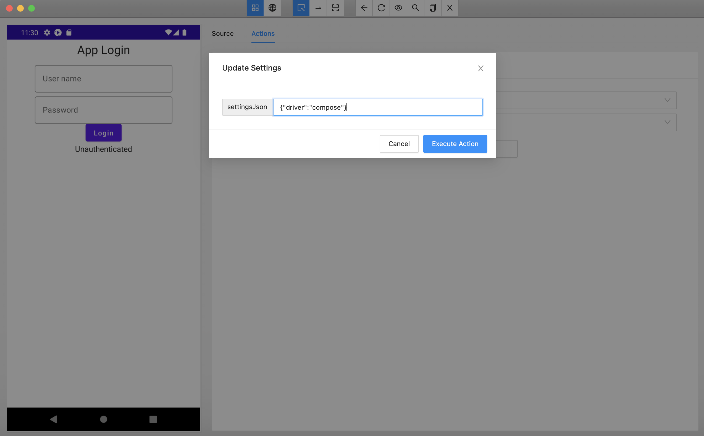
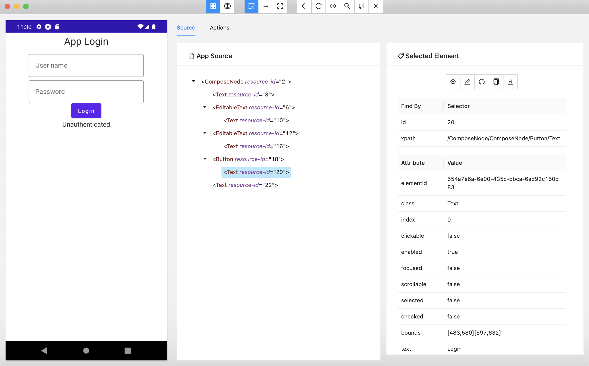

# Appium Java automation - Jetpack compose
Appium automation project using kotlin, gradle, cucumber.

This sample code demonstrates the appium automation of Android Jetpack compose views.

## Android App project
A simple app written in Jetpack compose with just a login screen

## Appium project
Appium gradle project written in kotlin using cucmber.  
Appium Espresso driver is required to get the compose views. Because of some incompatibility in the Appium espresso driver app, a workaround is necessary in the capabilities.  
Tested with appium version 1.23.0-beta.0

## Test report


## Android App


## Espresso driver with compose 
In order to make the Espresso driver to detect compose view elements, the driver settings need to be updated(https://github.com/appium/appium-espresso-driver/blob/master/README.md#settings-api)
```kotlin
setSetting("driver", "compose")
```
## Appium inspector
Appium inspector can't detect the compose view elements by default.
### Appium inspector with Espresso driver
This is how Appium inspector shows the compose views 
  

In order to change the driver to compose mode, update the settings in Actions. In Actions tab, select 'Session', 'Settings' and 'Update settings' button.
```json
{
  "driver": "compose"
}
```
 
This will update the driver mode to compose and the compose nodes will show up on refresh.

 
