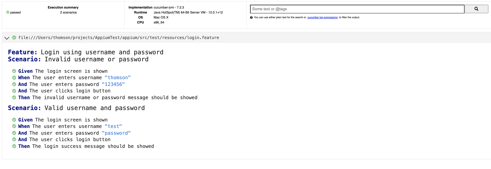

# Appium Java automation - Jetpack compose
Appium automation project using kotlin, gradle, cucumber.

This sample code demonstrates the appium automation of Android Jetpack compose views.

## Android App project
A simple app written in Jetpack compose with just a login screen

## Appium project
Appium gradle project written in kotlin using cucmber.  
Appium Espresso driver is required to get the compose views. Because of some incompatibility in the Appium espresso driver app, a workaround is necessary in the capabilities.  
Tested with appium version 1.23.0-beta.0

## Test report

## Android App

